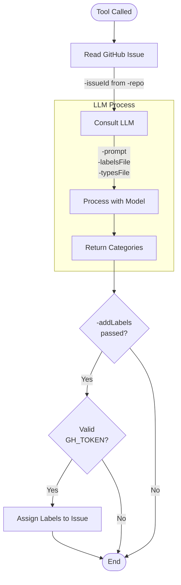

# Automatically triage a Github repository issue with OpenAI models

`auto-triager` automatically triages Grafana issues using OpenAI Models

## GitHub action integration

You can use the tool with GitHub Actions to automatically triage issues.

For more information, refer to [GitHub Action integration](./docs/github-action.md)

## Use auto-triager with OpenAI models

### Requirements

- Go 1.22.3 or higher installed
- [Mage](https://magefile.org/)
- The `GH_TOKEN` environment variable set to a GitHub personal access token with at least read access to public repositories.
- The `OPENAI_API_KEY` environment variable set to an OpenAI API key.

  If you want the tool to also update the issue with the generated labels you can pass the `-addLabels=true` flag.
  To update issues with labels, your token must also have the permissions to add labels to issues.

### Run `auto-triager`

To run `auto-triager`, use the following command:

```bash
mage -v run:triagerOpenAI <ISSUE ID>
```

Where _`ISSUE ID`_ is the issue ID you want to triage.

## Options

```
Usage of ./bin/linux_amd64/triager-openai:
  -addLabels
        Add labels to the issue in the repo via the GitHub API
  -categorizerModel string
        Model to use (default "gpt-4o")
  -issueId int
        Github Issue ID (only the number)
  -labelsFile string
        Labels file. One label per line (default "fixtures/categoryLabels.txt")
  -repo string
        Github repo to push the issue to (default "grafana/grafana")
  -retries int
        Number of retries to use when categorizing an issue (default 5)
  -typesFile string
        Types file. One label per line (default "fixtures/typeLabels.txt")

```

## How does it work?


